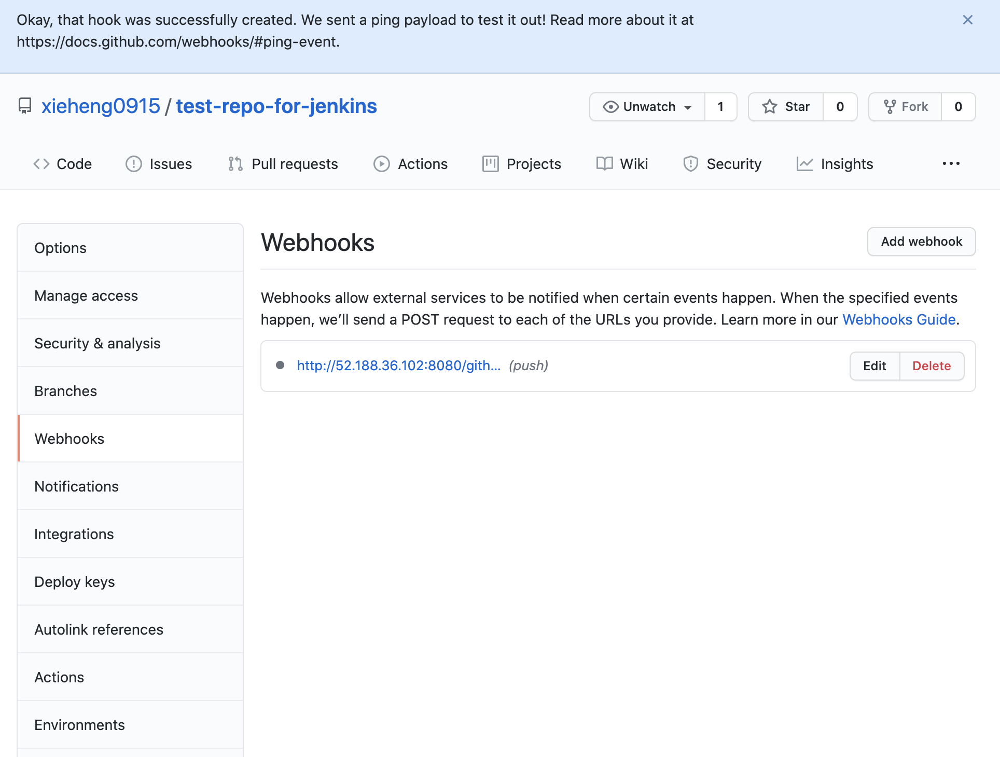

## github + jenkins + Azure インテグレーション

###### 1.Push jenkins to Azure
- 前提条件：  
    すでに docker hub に login 済み

- 1.1) Mac - terminal で context を作成：
```
docker context create aci myacicontext //"myacicontext"は他の名前に切り替えで良い
docker context ls // 確認
```
上記、複数のsubscription、resource-groupがある場合に自動にCommandlineで聞かれて選択できる。

- 1.2) プッシュjenkins to azure
```
dockder --context myacicontext run -p 8080:8080 -p 5000:5000 jenkins/jenkins:lts
```
しばらく待つと、portal でazure container instance を確認する
　　

上記、jenkins serverは global IP：(http://52.188.36.102:8080/)でアクセスできる。  

- 1.3) Terminal で　確認方法：  
```
docker context use myacicontext
docker ps //azure上動いているコンテナーを確認できる
CONTAINER ID        IMAGE                 COMMAND             STATUS              PORTS
upbeat-bell         jenkins/jenkins:lts  
docker logs upbeat-bell // jenkinsの初期パスワードはログからチェックする
```

###### 2.Jenkins preparation
- 2.1) Jenkins 初期化　
  初期パスワードは上記1.3より確認とCopy＋Paste、Default Pluginを自動化インストールする

- 2.2) Github Pluginのインストール 
  Dashboard -> Manage Jenkins -> Manage Plugins  
    
  Search bar -> github -> github integration, auto restart check-box を選択しておく  
  
　
　Jenkins restart 済みしておく　　

###### 3.Integration with github
- 3.1) jenkins でnew view,input view name, -> select Freestyle ->「OK」
  github project -> project url (on github) 
  source code managent -> git -> repositories -> github project repo 
    
  Scroll ...  
  Build Triggers -> GitHub hook trigger for GITScm polling   
    

  - 3.2) Github でwebhookを作成　　
  github -> CI/CD 対象プロジェクト -> Settings -> Webhooks 
  Payload URL: jenkins url + /github-webhook/   
  Content type: applicaiton/json 
  Pushだけ通知することに　　
    
    

  - 3.3) test 
    + repo で　ファイルを編集、Push
    + jenkinsで自動反映とBuild
    
    + Build 済み
   