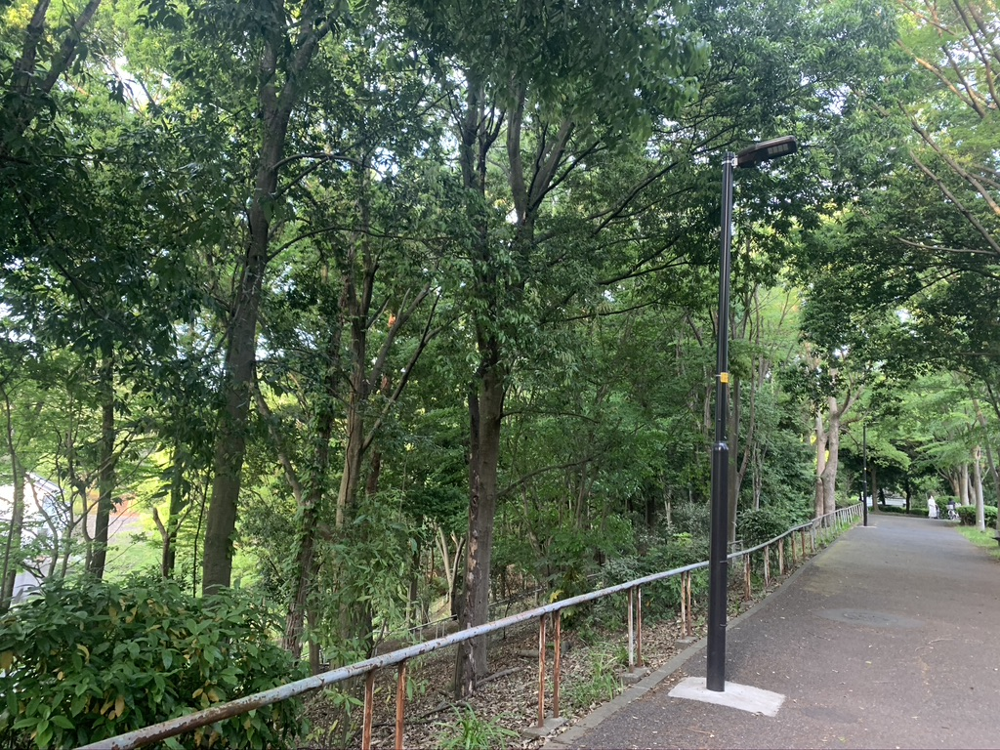

### 后山沉思录

_后山的神秘园/五月傍晚的风/繁花压树/风从叶间略过/如同插入发间的手指_

  

写作不是为了表达，而是为了更好地思考。
写作不是思考的结果，而是思考的媒介。

我决定放弃修辞，而只专注于捕捉那些在后山中的思维的电光火石的瞬间。

##### 1. 天才
互联网、谷歌搜索引擎的出现，其影响之深远，超过了想象。
我记得上大学时期对于天才的认知，其中一个能力是记忆力，一位被称为天才的同学看完一本厚厚的世界历史书而对里面的历史事件的年份过目不忘被人津津乐道。
而今天我们不需要记忆力，就像计算器的出现让我们对于速算心算技能的兴趣立刻就失去了。

当年的天才，如果生于现在的时代，还会是天才吗？

##### 2. 考试
另一方面，学校的教育体系，考试，不还是停留在记忆导向吗？
也不用说学校教育，就是那些认证考试，同样也是如此。

那么教育体系所筛选出来的精英，究竟有多少参考意义？
当年的考试成绩，真的能够去评判一个人今后的成就吗？

但另一方面，教育并不是没价值，教育的价值是培养思维能力，体系化知识的能力，
同时理工科也培养很多实践能力（小镇做题家是实践的产物）
这可能是理工科目前还是比文科更有价值。
因为目前的文科还不能提供足够社会实践和社会实验
但在欧美国家的文科恰恰是能提供的，因此欧美的文科非常强。

##### 3. 技术和设计
上层思维是设计思维（design thinking），
下层思维是各种架构设计和各种技术的展开

这两个都很重要，但顺序一旦颠倒，便会进入拿着锤子看什么都像钉子的思维模式。

求知欲是另一种毒瘾，要加以克制，提高专注，与其多掌握几门技艺，不过跳槽一年多出一点工资，换个赛道做工具人，是不是应该专注设计什么样的产品，做一些更有趣的事情？

##### 4. 中国式企业家的成功
国内市场的特点，一个是相对封闭（政策保护）的环境可以通过模仿国外的产品做“创新”，所谓的对标，其实就是模仿别国的产品。一个是流量，病毒式传播营销手段方式开拓市场。这两点非常中国特色。

还有第三点，是质量，因为低端多鱼龙混杂太多，像农夫山泉这样确实有稳定质量的就也能稳拿市场。这里面还有国外产品关税壁垒和本来的消费水准的落差给国内产品提供的空间。

##### 5. 创新
从中国市场的特点而言，中国的创新其实不是创新，99%都是在模仿，西方鄙夷为抄袭，但这也没有办法，这是中国的消费现状决定的。
中国最大的能量，依然是市场，是人口和经济增长带来的消费欲。
这在别的国家是没有的。

抖音是创新，抖音获得的成功也是国际化的，但背后似乎有一种利用人性弱点的恶意。

身在日本，要在国际环境下做创新，其实消费心理、产品环境都是不同的。
例如在日本消费欲望不是很高，但另一方面共享分享的需求却是一样的。（这是一个例子）

##### 6. 寻找利基
消费心理学确实很重要，问题是如何找到价值利基，靠市场调查这种陈旧的手段吗？大数据分析在很多场景下实用性还有待提高，似乎更多是靠天才经营者的直觉。

##### 7. 系统思维和线性思维
好系统的三个特征： 抗打击、自组织、层级关系（阿米巴）
自适应性，自主性，系统能自动适应恢复外在打击
每个系统中的成员对系统都是有输入，但形成什么的作用结果是未知的，因为有很多input，其相互作用未知。

线性思维的特点是直接干涉系统，比如一些政策令。
表面上政策的执行效率，实际上会破坏系统的平衡，而一些系统通过自我调整之后会依然恢复到之前的样子，因此从长期去看没有什么效果，而短期可能又可能导致致命性破坏。

##### 8. 穷人思维和富人思维
真的有所谓的穷人思维和富人思维吗？还是手里的资源不同，决定了思维的不同？
手里的握着可以改变K线图走向的资源，和手里的钱只能够紧张得每天寻找股市风向的人，思维和格局能一样吗？
反而后者如果有前者的思维，不正成为了被笑骂吃地沟油操白粉心的对象么？

是先有思维的改变再有财富的改变，还是先有资源的改变再有思维的改变？
那么，致富真的是靠思维和格局吗？

何况，越是穷人，越是解决眼前的事情为主，但这不是格局问题，这也不是愚蠢。
看TED的演讲：how the poor see the life, uneducated, but not stupid 有感  

