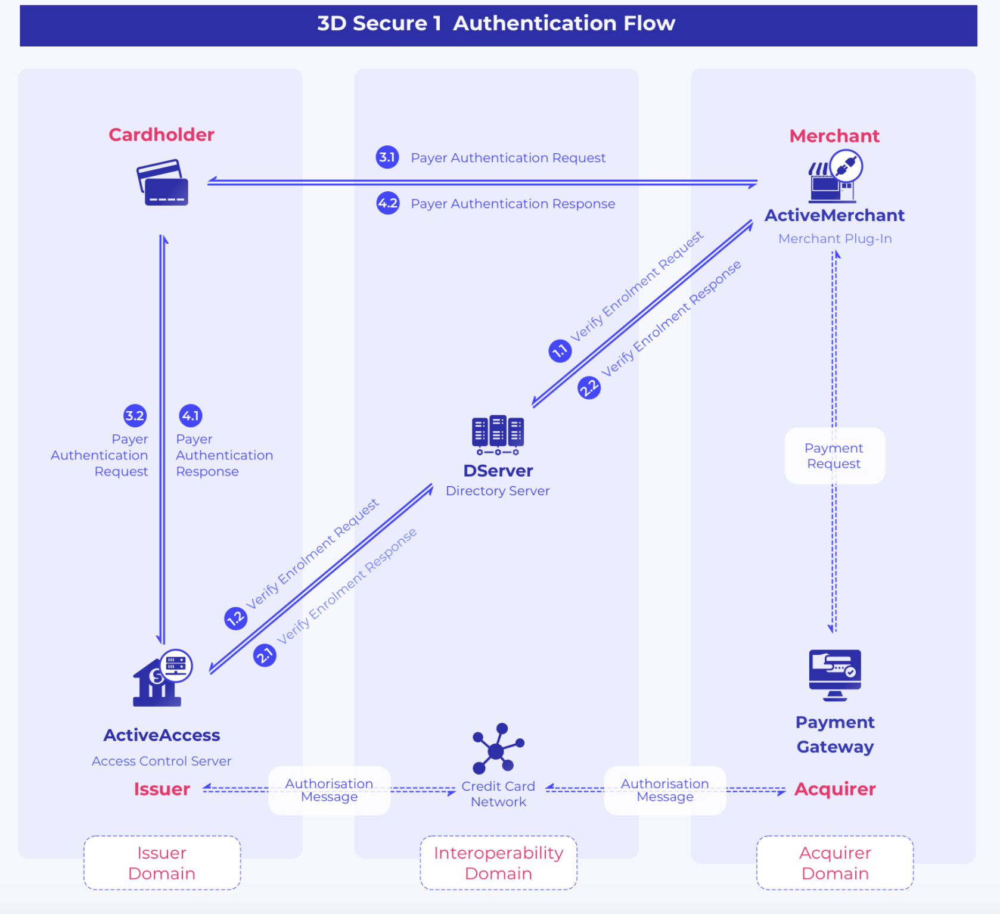

- merchant MPI
- cardholder

- 3Dセキュアとは
  「3Dセキュア」の「D」は「ドメイン」の略です。ドメインには、アクワイアラードメイン(Acquirer domain)、イシュアードメイン(Issuer Domain)、さらにその2つをリンクさせる相互運用ドメインの3つがあります。
  3DS1:  
  https://www.gpayments.com/jp/about/3d-secure/
  
  3DS2:  
  https://www.gpayments.com/jp/about/3d-secure-2.0/
  
  
- ACS CAVs
  ACS: Access Control server (上記の図を参考)

- Active DS (Directory Server)：上記図の参考
- BIN範囲とは
  BIN：Bank Identification Code
  

- 
- CAVVとは
  Cardholder Authentication Verification Value
  https://card-db.com/knowledge/3d-secure-256.html

  - カード番号が加盟店ウェブサイトに残ることなど
  ”3Dセキュアは国際ブランドの発案で、比較的簡易に加盟店ウェブサイト、アクワイアラー、イシュアーが対応可能なように配慮された仕組みである。しかし、カード会員が今までは意識しなかった「パスワード」の入力を求められ従来のネット決済とは異なること、カード番号が加盟店ウェブサイトに残ること、加盟店側の対応が思うほど簡単ではないこと、などいくつか課題が指摘され、その導入は当初想定していたほど進まない状況である。”

  - 3DSecure 1.0 vs. 3DSecure 2.0:
    Ver2.0はVer1.0 と比べ、決済の時間は約8割減、かご落ちが7割程減ることが想定されています。

追加認証の方式は、ワンタイム・パスワードなどの動的パスワードが推奨されます。つまり、安全性が高まると同時に、ユーザのパスワード忘れによる途中離脱が避けられます。

ワンタイム・パスワードは、SMSやアプリが使われます。
　　

- SAS連携：
  SASとはStatistical Analysis Systemという名前の、コンピュータソフトウェアの１つです。ＳＡＳの主たる目的は、その名の通り、統計計算です。いわゆる「統計パッケージ」として分類されるものです。

- AB鍵?
- ３Dセキュア はASPサービスであるとは？
- ACSにCAVV 生成バグ
- オーソリにCAVV検証のバグ
- オーソリとは
  オーソリとはAuthorizationの略語、クレジットカードでの決済においてはそのカードで決済できるかを確認する手続きのことを指し「オーソリ」とも呼ばれます。（オフラインの機器に対して専用用語？）

  カード有効性、カード利用限度額の確認できるが、本人確認できないため、
  OTP（３Dセキュア）を加えて認証する

- ASPサービスとは？
  ASPサービス：Application Service　Providerサービスです。
  https://ms.repica.jp/column/024/

- ACSとDS代行?
- ワンストップサービス　（引越しOSSポータル）?

- 3DSecure: OTP以外の動的なパスワード
  + 認証機能つきキーホルダーやワンタイムパス
  + 生体認証
  + QRcode
  + 秘密の質問など 

- 3DS1 と　3DS2 の違い：
    https://3dsecure.asseco.com/insights/3ds1-vs-3ds2-how-is-it-different/

    - In-App purchase support without an HTTP redirection
      made issuer abandoned 3DS transactions on mobile

- PSD2: payment services directive
- SCA: Strong Customer Authentication

- Payment gateway (Paypal, stripe etc) vs. credit card