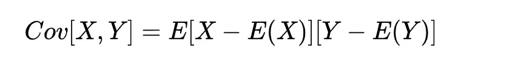
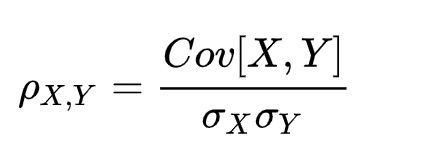
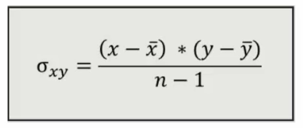
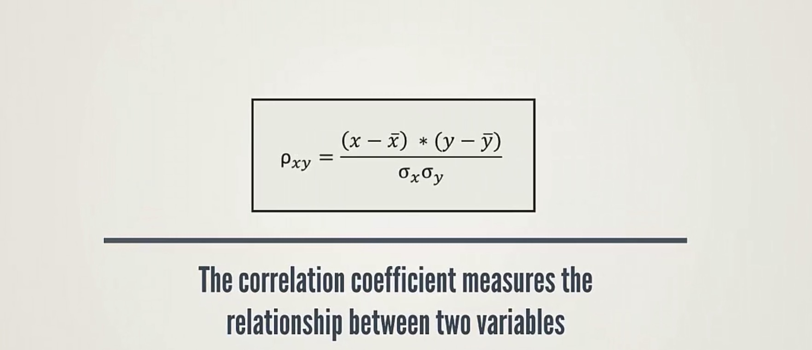
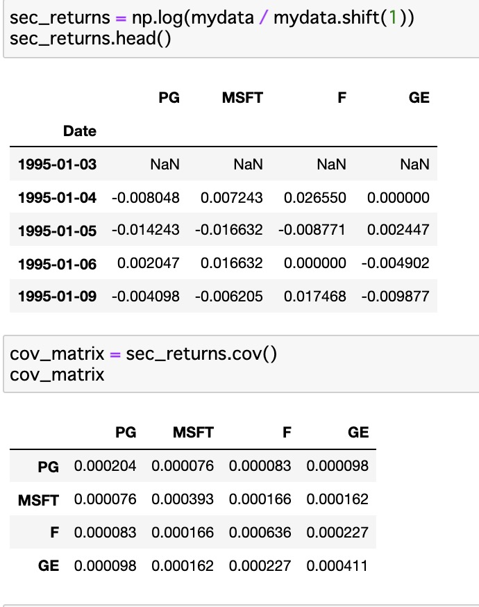
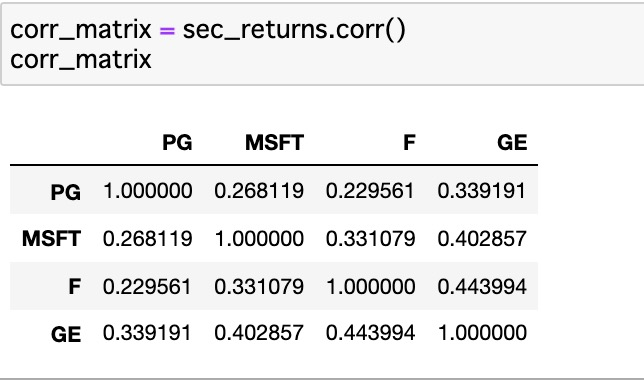
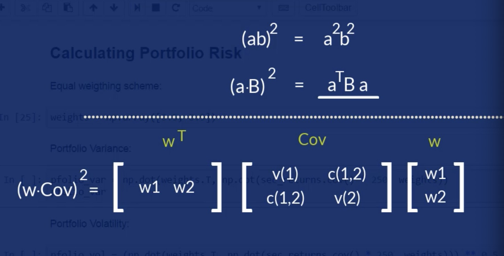
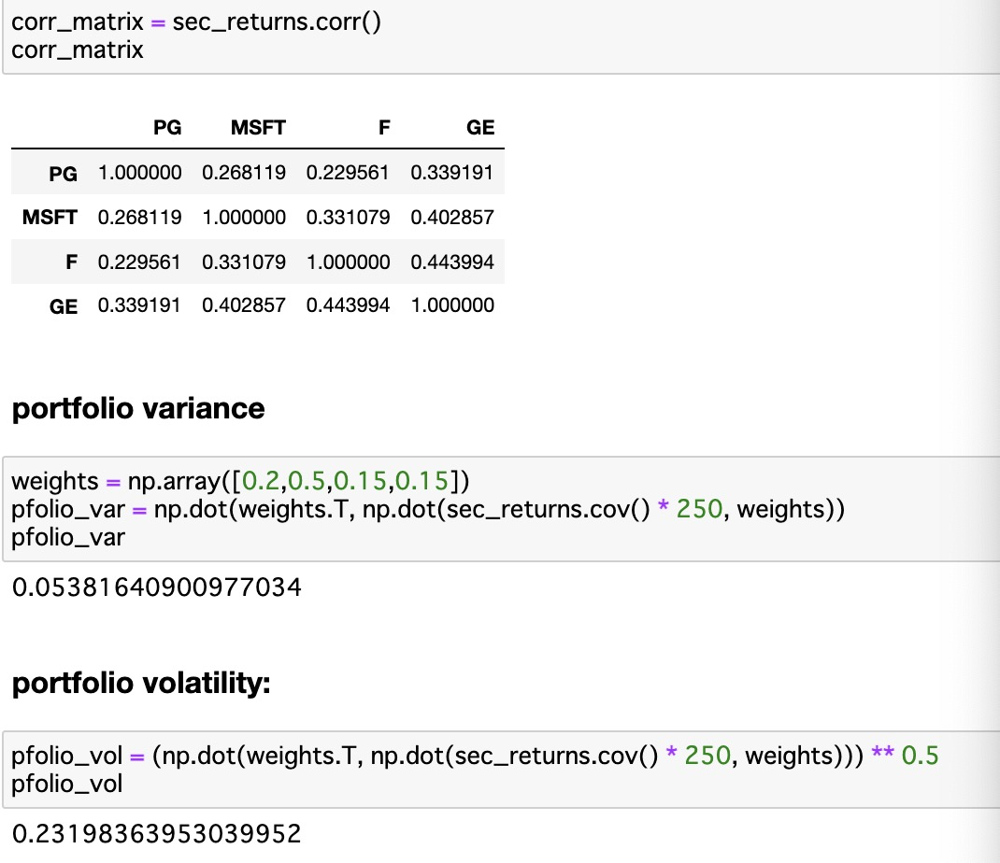
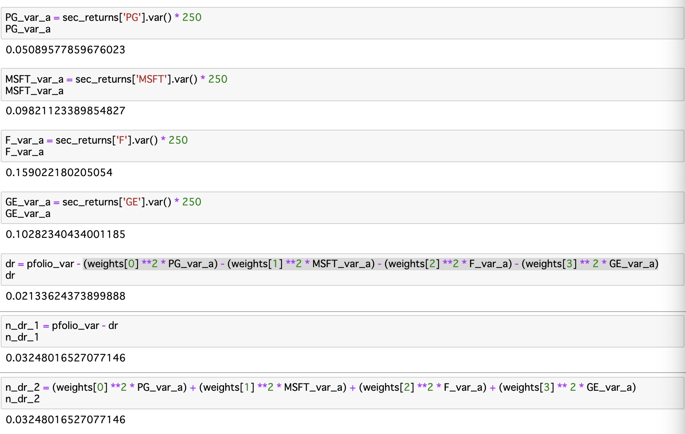

##### 协方差公式：  

E(X), E(Y) : 数学期望值
E(X) = X1*p(X1) + ... + Xn * p(Xn) 
※p(Xi) 为X的概率

##### Correlation efficient 相关系数：

σ(x) ：标准差
σ(x) = sqrt((x - x.mean) ^2)
方差：(x-x.mean) ^2 

ρ> 1: 正相关
ρ = 0: 不想关
ρ < 1: 负相关  
&nbsp;   
##### 在计算投资中如何求covariation and correlation
- *_Covariation_*
 

   + Covar > 0: x,y move to same direction
   + Covar < 0: x,y move to opposite direction
   + Covar = 0: x,y is independent  
   *_协方差不代表彼此成因果关系，而只是成相同或相反方向发展_*    
&nbsp;   
- *_Correlation_*

  + Cor > 1: 完全正相关，x是y的唯一变化因素
  + Cor < 1: 完全负相关，x是y的唯一变化因素
  + Cor = 0: independent
  + 非完全负向相关： -1 < Cor < 0
  + 非完全正向相关： 0 < Cor < 1

- *_python中var和cov的区别_* 
  + var: 方差，cov: 协方差 cov=var/(n-1), 
  + python中cov是一个矩阵,对角线上是var, 其余是cov 

    *_python 的numpy module可以直接计算协方差，如下：_*
      

    *_python 的numpy module也可以直接计算相关系数，如下：_*
      

    **_但是要特别注意的是，收益的相关系数不代表价格的相关性_**
   
&nbsp;   
- *_计算portfolio的risk_*  
  + 计算原理  
  
  + 实际计算例子  
    

- *_Non-diversifiable(Systemetric) and Diversifiable(non-systemetric) risks_*  
   + 非系统性风险为各个股票的风险合计值
   + 系统性风险为以上风险之外的风险
 以下提供了计算portfolio的系统性风险和非系统性风险的方法（2种）
 

&nbsp;  
*_参考：_* 
[covariance（协变）和 correlation（相关性）如何理解他们的区别？](https://www.zhihu.com/question/298114592)
[如何计算数学期望](https://blog.csdn.net/seasongirl/article/details/80208609)