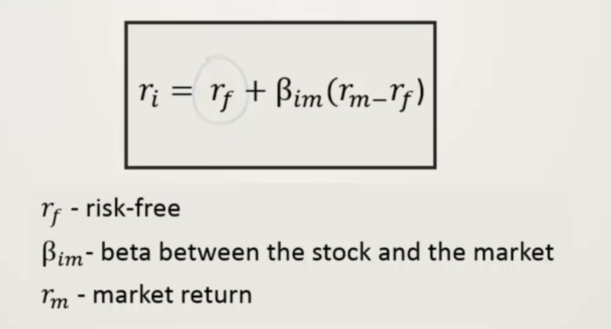

- MPT(Modern Portfolio Theory), 又称为 Markowitz portfolio theory,
着重于风险和回报的计算, portfolio voladility vs. Portfolio return
Portfolio Voladility: standard variation ^ 2

  - 下图为P&G和标普指数的MPT图
    + 

- CAPM：Capital Asset Price Model 
  如下MPT图的切线为CAPM线，截距为risk-free return 
    + 
  CAPM 假定有risk-free 的资产存在（通常债券可以认为是risk free)
  从MPT图可以得出，风险越高回报越高，风险越底回报越低。
    + 当把某只股票和市场指数比较（比如S&P指数）Beta值表示了该股票和市场表现的关系。
    如下所示，
    + 
    + 
  
  - Beta值的计算：
    + 
    
  - CAPM计算公式：
      + 
      + 
    - python程序的beta计算：
      + 

- Sharp Ratio： 用以评估回报和风险的比例
  - Sharp Ratio 的定义
    - 回报率越高，sharp ratio 值越大， 风险越高， sharp ratio 值越小
      + 
      +   

- α值：   
  描述的是没有风险情况下的收益，通常α=1%是基金经理的投资基数，如果低于1%则基金无盈利，  
  α<0 的情况下投资收益较差
  

- Ref：
  - [多因子系列篇一 (上) -- 现代组合理论 (Modern Portfolio Theory)](https://zhuanlan.zhihu.com/p/82743646)
- 参考书：
  - 《主动投资组合管理》 
  - 《量化股票组合管理》
  - 参考公式
   