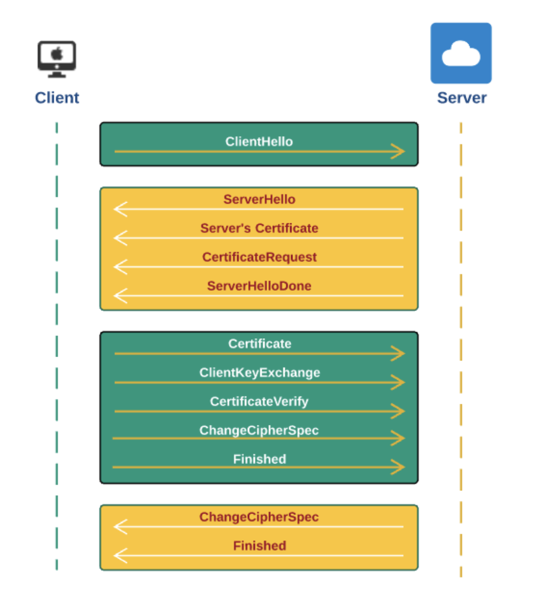
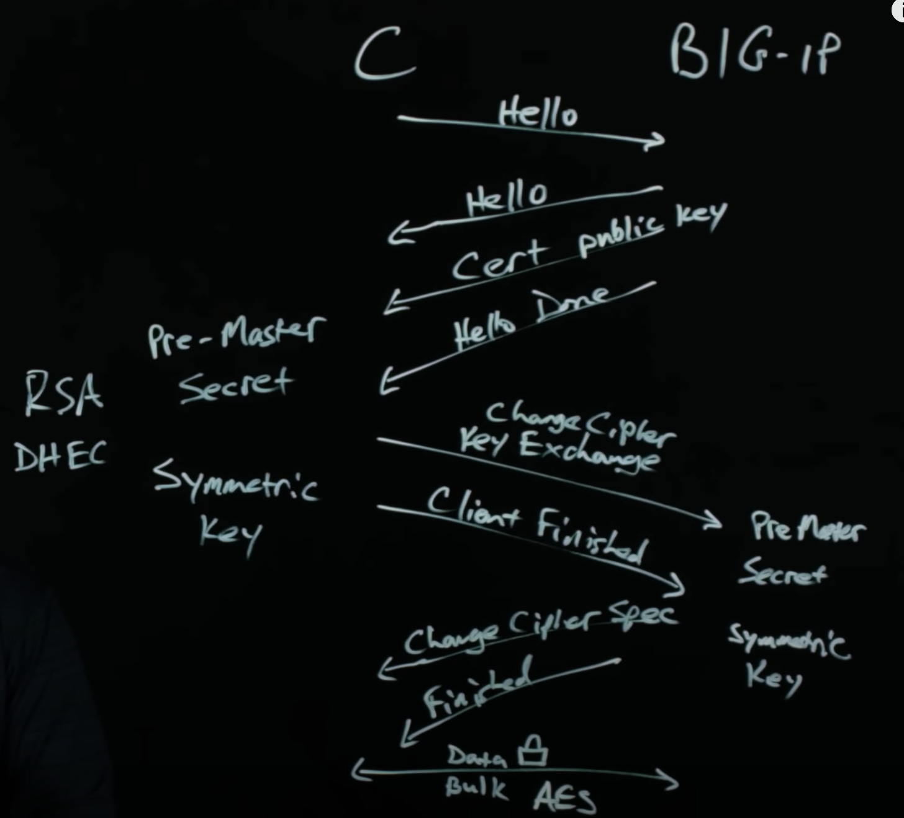

### 双方向のSSL通信仕組み

##### 1. One-Way vs. Two-Way　SSL通信

- One-Way SSL: 
  - クライアントがサーバを認証するだけ,eg: https://youtube.com
  - B2C通信、サーバとクライアントの通信によく使われています。
- Two-Way SSL:
  - クライアントとサーバ両方相手を承認する
  - 証明書を交換する
  - B2B通信、サーバとサーバ間の通信によく使われています。

##### 2. Two-Way SSL通信の仕組み

1. Client Hello, information includes: 
   - Client Version
   - Client Random (A 32 byte random num to be used for generating encryption key)
   - session ID (blank if a new session)
   - Compression Method (Compression method to be used if compression is needed for SSL packets)
   - Cipher Suites (List of all cipher suites supported by client. Preferred on is first in the list) 
2. Server Hello: 
   - Server Version(SSL/TLS Version selected by the server from the client provided list)
   - Server Random(A 32 byte random num to be used for generating encryption key)
   - Session ID(Client provided session id or a new id in case of a new session)
   - Compression Method(selected compression method from the list provided in client Hello)
   - Cipher Suites(selected cipher suite from the client's proviced list)
3. Server Certificate
   - Server sends its **certificate** to the client containing **public key** of the server, the certificate acts as an identity of the server. Client validates this certificate to ensure it is not expired, it is issued by a trusted CA, it's digital signature is valid. 
4. Certificate request (CSR): only used in 2-way auth
5. Server Hello done: server confirm the hello msg is finished.
6. (Client) certificate: 
   - To enable SSL/TLS communication with 2-way SSL, client sends its **signed certificate** to server
7. Client Key Exchange: 
   - Client creates a **pre-master secret** and sends it to server by sigining it with Server's pubic key
   - After decrypting pre-master key successfully, client and server will generate master secret using client random and server random communication ealier. This master secret will be used to create session key for encrypting/decrypting data for the entire session (**symmetric key**)
8. Cleint Certificate Verify: 
   - Optional step: Only when client send the certificate, then this step is needed, server verify using HMAC(pre-master secret)
9.  (Client) change cipher spec: 
   - At this point, the client is ready to switch to a secure, encrypted environment. The change ciper spec protocol is used to change the encryption. 
11. (Client Handshake) Finished
   - Handshake completed 
11. (Server) change cipher spec
   - The server is also ready to switch to an encrypted environment. Any data sent by the server will be encrypted usint **symmetric shared key** 
12. (Server handshake) Finished: 

##### 3. Cipher Suite: 
Cipher Suiteは下記のUnitsが持っている。
- Protocol: TLS1.1, TLS1.2,TLS1.0, SSLv3, SSLv2 
- Key Exchange: DH,DHE, ECDHE, RSA
- Auth: RSA, ECDSA
- Cipher: AES, GCM, ICBC
- MAC: SHA, MD5 
  
samples of Cipher Suite: 
1. ECDHE-RSA-AES128-GCM-SHA256
2. AES128-SHA : In such case, KeyExchange and Auth used default RSA, 

##### 4. TLS仕組み（まとめ）

1. Client send Hello to Server
2. Server send Hello to Client
3. Server send certificate with public key to client
4. Server Done
5. Client: Encrypt certificate/public key (Pre-Master Secret), change cipher and do key change 
6. Client side generate Symetric key for later real-time data communication
7. Server: Generate Pre-Master Secret and Symetric key of server side for later data communication
8. Client finished
9. Server change cipher suite 
10. Finished (server)
11. Start the real-time data transferring mutually with symetric keys

ref: 
https://www.youtube.com/watch?v=ohn89zOcf4M

次へ：
[HTTPSの仕組み、CA及びself-signed certificate について](./SSL_CA_Certificate.md)