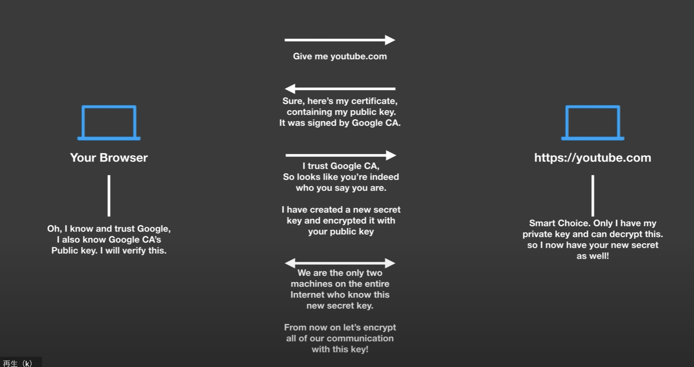

### HTTPSの仕組み、CA及びself-signed certificate について

##### 1. HTTPSの仕組みについて

1. クライアントはリクエストをサーバへ送信
2. サーバが自分のCAに認証済みのパブリック鍵をクライアントに渡す
3. クライアントはCA認証済みの鍵を信頼する
4. クライアントは新たに秘密鍵を生成、パブリック鍵に加える。
5. クライアントとサーバ側の1対1の通信を成立させる
6. 今後の通信とデータは５番の組み合わせ鍵により保証される。
7. サーバ側は自分が持っているPrivate鍵によってその組合せ鍵の中のパブリック鍵を常にデータソースを認証できる

##### 2. CA認証の仕組みについて

CA: Certification Authority

1. サーバ側が鍵ペアを生成して、今後パブリック鍵を使うため、CAに認証してもらう、そのため、自分の秘密鍵によってCSRファイルを生成、CAへ渡す。
2. CA側は自分の秘密鍵によってCSRをサインして、認証を行う。
3. 今後クライアント側はCAのパブリック鍵を持っていば、認証済みのサーバに対して信頼する。
4. クライアントはサービスを提供しているサーバをアクセスする時点に、サーバのパブリック鍵を自分持っているCAのパブリック鍵によって確認する。
   ✳︎各ブラウザーは各種CAのパブリック鍵を持っている。
5. 通信やデータの転送を行う。
   
##### 3. Self-signed certificateについて

 

1. CAサーバの自分で立ち上げている環境を使っている
2. ローカル環境で多数のアプリケーション間の通信はself-signed certificateによって行う。

ref: 
[How does HTTPS work? What's a CA? What's a self-signed Certificate?](https://www.youtube.com/watch?v=T4Df5_cojAs&t=4s)

次へ：
[Keystore、TrustStoreと通信処理サンプル](./ks_ts_cert.md)

