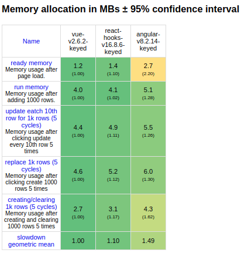

## Angular/React/Vue　プラットフォームの比較

1. 思想、哲学  

   <table>
      <thead>
         <tr>
            <th>Angular</th>
            <th>React</th>
            <th>Vue</th>
         </tr>
      </thead>
      <tbody>
         <tr>
            <td>性能豊富</td>
            <td>最小性能セット、UI向け性能強化</td>
            <td>Angular と　React の間</td>
         </tr>
         <tr>
            <td>PlatformよりFramework</td>
            <td>FrameworkよりLibrary</td>
            <td>Frameworkであり, Code重視</td>
         </tr>
         <tr>
            <td>Code以外、CLI、PWAなど充実</td>
            <td>第三者のツールでRoutingとhttpclientなど機能補足必要</td>
            <td>Code重視が、CLI機能やroutingなど機能も提供</td>
         </tr>
      </tbody>
      
   </table>
   
2. 特徴
   
3. 学習コスト  
  

   <table>
      <thead>
         <tr>
            <th>Angular</th>
            <th>React</th>
            <th>Vue</th>
         <tr>
      </thead>
      <tbody>
         <tr>
            <td>かなり複雑な構造</td>
            <td>性能削除上で構造が簡潔化</td>
            <td>必要に応じて構造変更可能</td>
         </tr>
         <tr>
            <td>TypeScript 必須</td>
            <td>Javascript + JSX/TSX</td>
            <td>Javascript のみ</td>
         </tr>
         <tr>
            <td>HTML,TS 分ける構造</td>
            <td>JS+HTML　結合構造</td>
            <td>JS, HTML 分ける構造(MVVM)</td>
         </tr>
      </tbody>
      <tfoot>
         <tr>
            <td>学習コスト: 高</td>
            <td>学習コスト：中</td>
            <td>学習コスト：低</td>
         </tr>
      
      </tfoot>
   </table>

4. 性能  
   Bundle Size: Angular > React > Vue  
   1. StartUp Speed:  
   
   1. Memory Allocation:  
   
5. 人気度  
   下記データはGoogle上サーチ回数の比較結果:
   
6. 将来性  
   下記はGitHub上Starをつける数  
   
7. その他情報  
   Angular 初回リリース：2010   
   React 初回リリース： 2013  
   Vue 初回リリース： 2014  

　　Angular community の開発者はその他のFWに徐々に流出している、人気度は下がっている状況。
     
   

### 結論

結論ありません。自分のニーズに合わせて選びましょう！

##### Ref：
 
1. [React, Angular or Vue: Choosing the Right Framework for Your Project](https://leanylabs.com/blog/react-angular-vue/)
2. [Youtube: create same app in vue and react and compare them](https://medium.com/javascript-in-plain-english/i-created-the-exact-same-app-in-react-and-vue-here-are-the-differences-e9a1ae8077fd)

