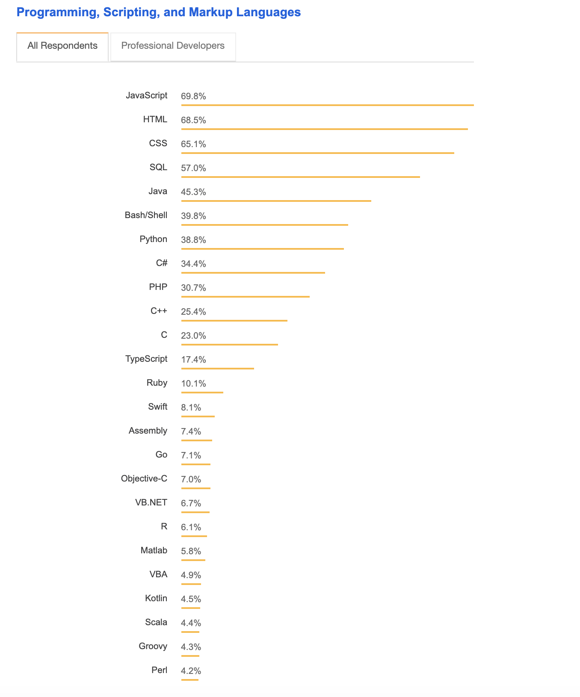

## Django vs Ruby on Rails vs Laravel バックエンド・フレームワークの比較

1. マーケティング・シェア、人気度(Marketing share)
   <table>
    <thead style="text-align:center">
        <tr>
            <th></th>
            <th>Django</th>
            <th>Ruby on Rails</th>
            <th>Laravel</th>
        </tr>
    </thead>
    <tbody style="font-size: middle;">
        <tr>
            <th style="font-size: middle">依存言語の人気度 (by Stack Overflow developer) *下記図を参考</th>
            <td>38.8%</td>
            <td>30.7%</td>
            <td>10.1%</td>
        </tr>
        <tr>
            <th style="font-size: middle">市場既存案件採用比率</th>
            <td>0.19%</td>
            <td>0.98%</td>
            <td>0.27%</td>
        </tr>
        <tr>
            <th style="font-size: middle">GitHubフォークされた回数</th>
            <td>17.3K</td>
            <td>17.1K</td>
            <td>15.5K</td>
        </tr>
        <tr>
            <th style="font-size: middle">Reddit得点</th>
            <td>5.33K</td>
            <td>2.16K</td>
            <td>3.44K</td>
        </tr>
    </tbody>
   </table>　　
   Stack Overflow 上統計した各言語使用比率：  

   
2. コミュニティ・エコシステム・ライブラリ(Community & Ecosystem & Library) 
   - Community  
     それぞれ堅実なコミュニティーを持ている。  
     <table>
        <thead style="text-align:center">
            <tr>
                <th>Django</th>
                <th>Ruby on Rails</th>
                <th>Laravel</th>
            </tr>
        </thead>

        <tbody style="font-size: middle;">
        <tr style="vertical-align: top;font-size: middle">
            <td style="width: 35%;font-size:middle">
                - 11,685開発者を持ち（2019/3時点) 
                - Mailing list & blogs: <strong>DjangoTricks etc.</strong> 
                - source code snippet sharing: <strong>Djangosnippets</strong> 
                - rich education resources: <strong>Official tutorial, website: "Django Girls"</strong> 
                - directory of Django packages: <strong>Django Packages</strong> 
            </td>
            <td style="width: 30%;font-size:middle">
                - 4500 貢献者を持ち 
                - Mailing list & community: <strong>RoR: Talk</strong> 
                - Weekly newsletter: <strong>This week in Rails</strong> 
                - Slack community: <strong>Ruby on Rails Link</strong> 
                - annual conferences: <strong>including RailsConf</strong> 
                - tutorial platform: <strong>GoRails</strong> 
                - Stack Overflow community: <strong>Ruby-forum.com</strong> 
            </td>
            <td style="width: 35%;font-size:middle">
                - education resources: <strong>Laracasts,Test-Driven Laravel etc. </strong> 
                - community forum: <strong>Laravel.io</strong> 
                - official blog: <strong>Laravel News</strong> 
                - Slack community: <strong>Lara#hat</strong> 
                - directory of packages: <strong>Packalyst</strong> 
            </td>
            </tr>
        </tbody>
     </table>  

   - Ecosystem
     <table>
        <thead style="text-align:center">
            <tr>
                <th>Django</th>
                <th>Ruby on Rails</th>
                <th>Laravel</th>
            </tr>
        </thead>
        <tbody>
            <tr style="vertical-align: top">
                <td style="width: 35%;font-size:middle">
                    - 4,000 packages 
                    - <strong>Django allauth: </strong> account auth via fb, twitter, google, github etc. 
                    - e-commerce apps: <strong>Django shop, Oscar, Catridge</strong> 
                    - rest apis: <strong>Django REST framework</strong> 
                    - real-time oper (notification, email, sms etc): <strong>Celery</strong> 
                    - debug: <strong>The Debug Toolbar</strong> 
                    - CMS system: <strong>Wagtail, Mezzanine </strong> 
                </td>
                <td style="width: 30%;font-size:middle">
                    - reusable code   
                    - real-time oper: email :<strong>Action Mailer</strong> 
                    - cloud file handler: <strong>Active Storage</strong> 
                </td>
                <td style="width: 35%;font-size:middle">
                    - 15.7k packages 
                    - Stripe integration(payment): <strong>Cashier</strong> 
                    - API: <strong>Envoy and Passport</strong> 
                    - full-text search: <strong>Scout</strong> 
                    - OAuth auth via Google, fb, github etc.<strong>Socialite</strong> 
                    - dev env tools: <strong>Homestead, Valet</strong> 
                    - CMS: <strong>Statamic</strong> 
                </td>
            </tr>
        </tbody>
     </table>
   - Library
     <table>
        <thead style="text-align:center">
            <tr>
                <th>Django</th>
                <th>Ruby on Rails</th>
                <th>Laravel</th>
            </tr>
        </thead>
        <tbody>
            <tr style="vertical-align: top">
                <td style="width: 35%;font-size:middle">
                    - <strong>built-in admin sections</strong>   
                    - auto-generated forms for models   
                    - caching   
                    - supportive middleware   
                    - internatianlization system, with components for variety of language 
                    - serialization system for XML/JSON 
                    - built-in unit test framework 
                    - authentication system 
                    - dynamic administrative interface 
                    - Having tools for <strong>generating Google sitemaps</strong> 
                    - <strong>Built-in security mitigation tools </strong>(csrf, sql injection, pwd cracking etc.) 
                    - having <strong>Rest framework(DRF)</strong> 
                </td>
                <td style="width: 30%;font-size:middle">
                    - Having tools for <strong>common development tasks</strong>, like "scaffolding" to automatically construct models 
                    - ActiveModelHelper: Magically active record tool, easier than ORM in Django and Laravel 
                    - Using shortcuts to write few lines of code  
                    - Auto routing 
                    - Very useful command line tool: rake 
                </td>
                <td style="width: 35%;font-size:middle">
                  - Bundles and composer for packaging system 
                  - Easistes way to manage Routing  
                  - <strong>Eloquent ORM support</strong> 
                  - Queue managent: could abstract queues and fasten response time 
                  - Easy for migration  
                  - Easy for <strong>testing and dependency loading</strong>  
                </td>
            </tr>
        </tbody>
     </table>
3. パフォーマンス、セキュリティー、スケーラビリティ(Performance & security & scalabity)
   
     <table style="font-size: middle">
        <thead>
            <tr  style="text-align:center">
                <th colspan="2">指標</th>
                <th style="width: 500px">強い--------------------->弱い</th>
            </tr>
        </thead>
        <tbody>
            <tr>
                <tr>
                    <th rowspan="5">Performance</th>
                    <td>Json serialization</td>
                    <td  style="text-align:center">Djando > Ruby on Rails > Laravel </td>
                </tr>
                <tr>
                    <td>data update</td>
                    <td  style="text-align:center">Laravel > Django > Ruby on Rails
                    </td>
                </tr>
                <tr>
                    <td>plain text response</td>
                    <td  style="text-align:center"> Django > Ruby on Rails > Laravel 
                    </td>
                </tr>
                <tr>
                    <td>single query test</td>
                    <td  style="text-align:center"> Django > Laravel > Ruby on Rails 
                    </td>
                </tr>
                <tr>
                    <td>multiple query test (*with join)</td>
                    <td  style="text-align:center"> Laravel > Ruby on Rails > Django 
                    </td>
                </tr>
            </tr>
            <tr>
                <th colspan="2">Security</th>
                <td  style="text-align:center"> Django > Ruby on Rails > Laravel </td>
            </tr>
            <tr>
                <th colspan="2">Scalability</th>
                <td  style="text-align:center"> Django > Laravel > Ruby on Rails </td>
            </tr>
        </tbody>
     </table>  

     [詳細レポート参考先：TechEmpower](https://www.techempower.com/benchmarks/#section=data-r17&hw=ph&test=fortune&l=y451q7-1&c=6&f=0-bam8-4fwb9c-27wr74-4fti4y-13ydj4-b8jk-2ubk-4)
   
4. ラーニング・カーブ
    習得難易度（難しい→易しい）  
      Laravel > Django > Ruby on Rails  
    - Django
        python 言語はシンプルで分かりやすい、Djangoの導入と立ち上げも早い、RORより難しい。
        さらにPython言語はAIやビグデータ関連開発領域にも一番活躍している。
    - Ruby on Rails
        Ruby言語は習得しやすい、Railsの導入はかなり分かりやすい。
        カスタマイズにはやり辛い、Debug環境はそれなり優れていない。
    - Laravel
        PHP経験を持つ開発者が多いので、言語の学習コストは下げる一方で、
        当フレームワークの構造、Bundlesに関して理解、作り込みのツールの使い熟しための学習コストやや高いとも言われている。
        開発のスピードはRoR、Djangoと比べると遅い。  

5. サンプルウェブサイト例
    - Django:  
        Instagram, Pinterest, Facebook, The Washington Post, NASA, Reddit, Dropbox, Spotify.  
    - Ruby on Rails:  
        Basecamp, GitHub, Dribbble, Crunchbase, Groupon, Shopify, Airbnb  
    - Laravel:  
        WordPress, Yahoo, Wikipedia, Flickr, Tumblr  

6. ３つFWの共通点・高評及び批判
   - 共通点：  
     - Object Oriented, MVC architecture,DRY principle(Don't repeat yourself) and KISS principle (Keep it short and simple)
     - Open-source
     - Multiple-platform support
   - Pros & Cons by experienced projects(高評及び批判)： 
     <table style="font-size:middle;">
        <thead>
            <tr style="text-align:center">
                <th style="width: 20%"></th>
                <th style="width: 40%">Pros</th>
                <th style="width: 40%">Cons</th>
            </tr>
        </thead>
        <tbody style="text-align:left;">
            <tr>
                <th>Django</th>
                <td>
                    - セキュリティ重視 
                    - SEO に向いている 
                    - バックエンド側データ分析、AIアプリと連携しやすい 
                    - 充実な学習資料、第三者開発ツールなどの提供 
                    - スケーラビリティ、カスタマイズのやりやすさ 
                </td>
                <td>
                    - Real-time アプリ(SMS,notificationなど)へサポートはない 
                </td>
            </tr>
            <tr>
                <th>Ruby on Rails</th>
                <td>
                    - 「設定より配置」設計方針で導入しやすい 
                    - 自動テストツールの提供 
                    - データベース操作しやすい 
                </td>
                <td>
                    - カスタマイズにやり辛いところ 
                    - Debug環境はあまり分かりにくい 
                </td>
            </tr>
            <tr>
                <th>Laravel</th>
                <td>
                    - Artisanツールで開発効率性を挙げている 
                    - Cloud Storage fileの操作機能は優れている 
                    - MVCモデルで分かりやすい 
                    - 提供されているonline payment moduleはECサイトに良い 
                    - PHP関連のテスト、パフォーマンス・チューニング経験は活用できる 
                </td>
                <td>
                    - Securityは３つの中に一番弱いが、開発より強化する必要（案件のセキュリティ希望による、そんなに弱くてもない） 
                    - Composer はnpm,ruby gemsと比べると、やや弱い。 
                </td>
            </tr>
        </tbody>
     </table>

     
7. その他
   Node.jsも検討に入れられているですが、Node.jsはRDBへの操作はあまり評判が悪い、  
   ORMなど機能はほとんどのバックエンドツールにとっては必須機能なので、比較対象に入れない。  

###### 参考先：
1. [Ruby on Rails vs Django vs Laravel: The Ultimate Comparison...](https://steelkiwi.com/blog/ruby-django-laravel-frameworks-comparison/)
2. [Django vs Laravel vs Rails](https://www.flowkl.com/article/web-development/django-vs-laravel-vs-rails/)
